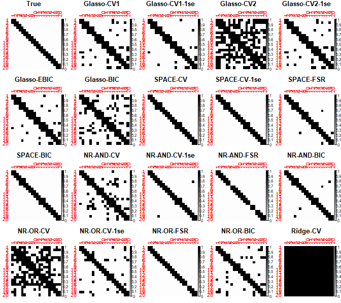
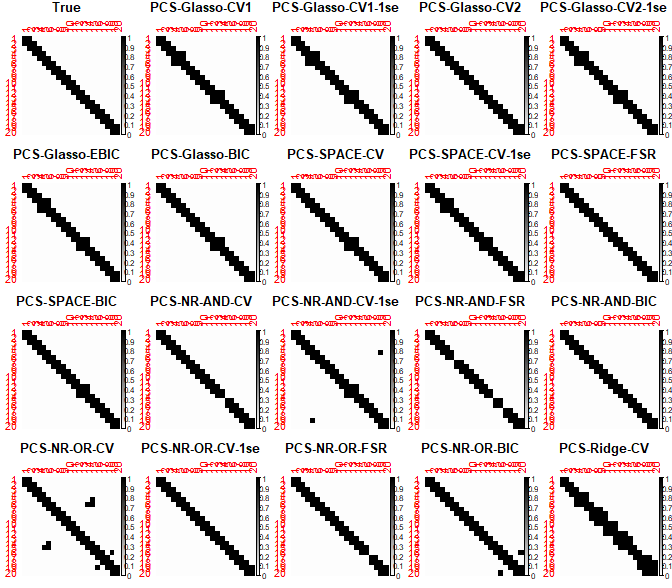
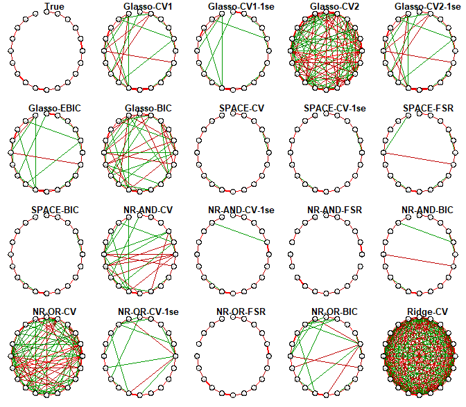
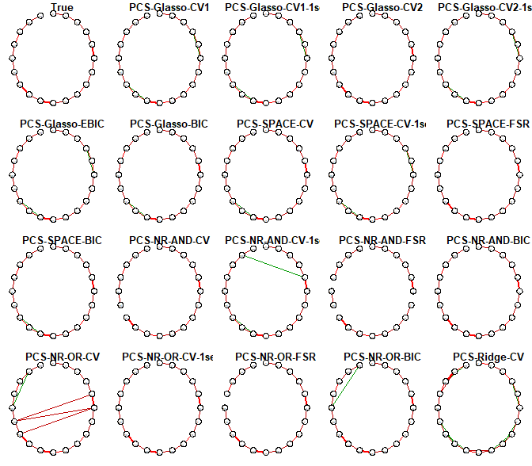

# PCS

## Partial correlation screening approach for controlling the false positive rate in sparse Gaussian Graphical Models

The R package contains functions used in the following [paper](https://www.nature.com/articles/s41598-019-53795-x):

Lafit G, Tuerlinckx F, Myin-Germeys I, Ceulemans E. A Partial Correlation Screening Approach for Controlling the False Positive Rate in Sparse Gaussian Graphical Models. Sci Rep. 2019;9(1):17759. Published 2019 Nov 28. doi:10.1038/s41598-019-53795-x

## Installation
You can install the development version from GitHub with:

```
library(devtools)
devtools::install_github("ginettelafit/PCS", force = T)
```
## Example - simulate data 

To illustrate how the PCS approach works, we simulated data by drawing 100 independent observations from a multivariate Gaussian distribution with mean zero and partial correlation matrix . We considered the dimension to be equal to 20. 
We assumed 2 neighbor Chain Graph for the population partial correlation matrix, in which ,  and  equal to -0.4, and all other edges are set to 0.

```
library(PCS)
library(Rlab)
library(psych)
library(MASS)
library(huge)

p = 20 # Set dimenensionality
n = 100 # Set sample size
 
# Generate the covariance (Sigma) matrix & simulate data N(0,Sigma) 

# Model 1: : 2 neighbor Chain Graph

Omega = diag(p)

for (i in 1:p){
Omega[i,i-1] = 0.4
Omega[i-1,i] = 0.4
}

Sigma = solve(Omega)

R = -cov2cor(Omega)
diag(R) = 1

save(R, file = "pcor_1_p_20.RData")

# Simulate Data
x = mvrnorm(n, rep(0, p), Sigma)
x = scale(x, center = TRUE, scale = F)
save(x, file = "sample_1_p_20_n_100.RData")
```

## Estimate GGM using Glasso, SPACE, and nodewise regression using lasso

```
# Glasso 10-folds CV1

  load(file = "sample_1_p_20_n_100.RData")
  rho.list = cv_glasso(x,fold=10)    
  rho = unlist(rho.list$rho_opt)
  list.glasso.cv = as.matrix(huge(x,lambda = rho,scr = F,method = "glasso")$icov[[1]])
  lambda.opt = rho
  save(lambda.opt, file = "lambda_glasso_cv_1_p_20_n_100.RData")
  save(list.glasso.cv, file = "glasso_cv_1_p_20_n_100.RData")

# Glasso 10-folds CV1-1se

  rho.ls1 = unlist(rho.list$rho_ls1)
  list.glasso.cv.ls1 = as.matrix(huge(x,lambda = rho.ls1,scr = F,method = "glasso")$icov[[1]])
  lambda.opt = rho.ls1
  save(lambda.opt, file = "lambda_glasso_cv_ls1_1_p_20_n_100.RData")
  save(list.glasso.cv.ls1, file = "glasso_cv_ls1_1_p_20_n_100.RData")

# Glasso 10-folds CV2

  rho = unlist(rho.list$rho2_opt)
  list.glasso.cv2 = as.matrix(huge(x,lambda = rho,scr = F,method = "glasso")$icov[[1]])
  lambda.opt = rho
  save(lambda.opt, file = "lambda_glasso_cv2_1_p_20_n_100.RData")
  save(list.glasso.cv2, file = "glasso_cv2_1_p_20_n_100.RData")

# Glasso 10-folds CV2-1se

  rho.ls1 = unlist(rho.list$rho2_ls1)
  list.glasso.cv2.ls1 = as.matrix(huge(x,lambda = rho.ls1,scr = F,method = "glasso")$icov[[1]])
  lambda.opt = rho.ls1
  save(lambda.opt, file = "lambda_glasso_cv2_ls1_1_p_20_n_100.RData")
  save(list.glasso.cv2.ls1, file = "glasso_cv2_ls1_1_p_20_n_100.RData")

# Glasso EBIC
# Glasso + EBIC estimated using the function huge.select from the R package huge
library(huge)

  load(file = "sample_1_p_20_n_100.RData")
  fit.ebic = huge.select(huge(x,lambda=seq(0.001,max(abs(cov(x))),length=100),method = "glasso"),
  ebic.gamma = 0.5,criterion = "ebic")
  lambda.opt = fit.ebic$opt.lambda
  list.glasso.ebic = as.matrix(fit.ebic$opt.icov)
  save(lambda.opt, file = "lambda_glasso_ebic_1_p_20_n_100.RData")
  save(list.glasso.ebic, file = "glasso_ebic_1_p_20_n_100.RData")

# Glasso BIC
# Glasso + BIC estimated using the function huge.select from the R package huge
library(huge)

  load(file = "sample_1_p_20_n_100.RData")
  fit.bic = huge.select(huge(x,lambda=seq(0.001,max(abs(cov(x))),length=100),method = "glasso"),
  ebic.gamma = 0,criterion = "ebic")
  lambda.opt = fit.bic$opt.lambda
  list.glasso.bic = as.matrix(fit.bic$opt.icov)
  save(lambda.opt, file = "lambda_glasso_bic_1_p_20_n_100.RData")
  save(list.glasso.bic, file = "glasso_bic_1_p_20_n_100.RData")

# SPACE with 10-folds CV

  load(file = "sample_1_p_20_n_100.RData")
  lambda.list = cv_space(x,fold=10)
  lambda.opt = lambda.list$alpha_opt
  R.opt = Psi_space(x,lambda.opt)
  list.space.cv = PCS_GGM(x,R.opt,0)
  save(lambda.opt, file = "lambda_space_cv_1_p_20_n_100.RData")
  save(list.space.cv, file = "space_cv_1_p_20_n_100.RData")

  lambda.ls1 = lambda.list$alpha_ls1
  R.opt = Psi_space(x,lambda.ls1)
  list.space.cv.ls1 = PCS_GGM(x,R.opt,0)
  lambda.opt = lambda.ls1
  save(lambda.opt, file = "lambda_space_cv_ls1_1_p_20_n_100.RData")
  save(list.space.cv.ls1, file = "space_cv_ls1_1_p_20_n_100.RData")

# SPACE with finite sample results result

  load(file = "sample_1_p_20_n_100.RData")
  lambda.opt = sqrt(nrow(x))*qnorm(1-0.05/(2*ncol(x)^2))
  R.opt = Psi_space(x,lambda.opt)
  list.space.alpha = PCS_GGM(x,R.opt,0)
  save(lambda.opt, file = "lambda_space_alpha_1_p_20_n_100.RData")
  save(list.space.alpha, file = "space_alpha_1_p_20_n_100.RData")

# SPACE with BIC

  load(file = "sample_1_p_20_n_100.RData")
  lambda.opt = BIC_space(x)
  R.opt = Psi_space(x,lambda.opt)
  list.space.bic = PCS_GGM(x,R.opt,0)
  save(lambda.opt, file = "lambda_space_bic_1_p_20_n_100.RData")
  save(list.space.bic, file = "space_bic_1_p_20_n_100.RData")

# Nodewise regression 'AND' with 10-folds CV

  load(file = "sample_1_p_20_n_100.RData")
  lambda.fit = cv_Neigh(x,10)
  lambda.opt = lambda.fit[[1]]
  list.nei.cv = neigh_and_lambda(x,lambda.opt)
  save(lambda.opt, file = "lambda_nei_and_cv_1_p_20_n_100.RData")
  save(list.nei.cv, file = "nei_and_cv_1_p_20_n_100.RData")

# Nodewise regression 'AND' with 10-folds CV-ls1

  list.nei.cv = neigh_or_lambda(x,lambda.opt)
  save(lambda.opt, file = "lambda_nei_or_cv_1_p_20_n_100.RData")
  save(list.nei.cv, file = "nei_or_cv_1_p_20_n_100.RData")

# Nodewise regression 'OR' with 10-folds CV

  lambda.ls1 = lambda.fit[[2]]
  list.nei.cv.ls1 = neigh_and_lambda(x,lambda.ls1)
  lambda.opt = lambda.ls1
  save(lambda.opt, file = "lambda_nei_and_cv_ls1_1_p_20_n_100.RData")
  save(list.nei.cv.ls1, file = "nei_and_cv_ls1_1_p_20_n_100.RData")

# Nodewise regression 'OR' with 10-folds CV-ls1

  list.nei.cv.ls1 = neigh_or_lambda(x,lambda.ls1)
  save(lambda.opt, file = "lambda_nei_or_cv_ls1_1_p_20_n_100.RData")
  save(list.nei.cv.ls1, file = "nei_or_cv_ls1_1_p_20_n_100.RData")

# Nodewise regression 'AND' with finite sample result

  load(file = "sample_1_p_20_n_100.RData")
  lambda.opt = rep((1/(sqrt(nrow(x))))*qnorm(1-0.05/(2*ncol(x)^2)),ncol(x))
  list.nei.alpha = neigh_and_lambda(x,lambda.opt)
  save(lambda.opt, file = "lambda_nei_and_alpha_1_p_20_n_100.RData")
  save(list.nei.alpha, file = "nei_and_alpha_1_p_20_n_100.RData")

# Nodewise regression 'OR' with finite sample result

  list.nei.alpha = neigh_or_lambda(x,lambda.opt)
  save(lambda.opt, file = "lambda_nei_or_alpha_1_p_20_n_100.RData")
  save(list.nei.alpha, file = "nei_or_alpha_1_p_20_n_100.RData")

# Nodewise regression 'AND' with BIC

  load(file = "sample_1_p_20_n_100.RData")
  lambda.opt = BIC_Neigh(x)
  list.nei.bic = neigh_and_lambda(x,lambda.opt)
  save(lambda.opt, file = "lambda_nei_and_bic_1_p_20_n_100.RData")
  save(list.nei.bic, file = "nei_and_bic_1_p_20_n_100.RData")

# Nodewise regression 'OR' with BIC

  list.nei.bic = neigh_or_lambda(x,lambda.opt)
  save(lambda.opt, file = "lambda_nei_or_bic_1_p_20_n_100.RData")
  save(list.nei.bic, file = "nei_or_bic_1_p_20_n_100.RData")

# Ridge regression with 10-folds CV

  load(file = "sample_1_p_20_n_100.RData")
  lambda.opt = cv_ridge(x,10)
  list.ridge.cv = ridge_lambda(x,lambda.opt)
  save(lambda.opt, file = "lambda_ridge_cv_1_p_20_n_100.RData")
  save(list.ridge.cv, file = "ridge_cv_1_p_20_n_100.RData")
```

## Control the false positive rate using PCS

```
# Glasso 10-folds CV1

  load(file = "sample_1_p_20_n_100.RData")
  load(file = "glasso_cv_1_p_20_n_100.RData")
  load(file = "lambda_glasso_cv_1_p_20_n_100.RData")
  R.opt = -cov2cor(list.glasso.cv)
  diag(R.opt) = 1
  tau.opt = cv_PCS_glasso(x,lambda.opt,fold=10)
  list.glasso.cv.pcs = PCS_GGM(x,R.opt,tau.opt) 
  save(tau.opt, file = "tau_glasso_cv_1_p_20_n_100.RData")
  save(list.glasso.cv.pcs, file = "PCS_glasso_cv_1_p_20_n_100.RData")

# Glasso 10-folds CV1-1se

  load(file = "sample_1_p_20_n_100.RData")
  load(file = "glasso_cv_ls1_1_p_20_n_100.RData")
  load(file = "lambda_glasso_cv_ls1_1_p_20_n_100.RData")
  R.opt = -cov2cor(list.glasso.cv.ls1)
  diag(R.opt) = 1
  tau.opt = cv_PCS_glasso(x,lambda.opt,fold=10)
  list.glasso.cv.ls1.pcs = PCS_GGM(x,R.opt,tau.opt) 
  save(tau.opt, file = "tau_glasso_cv_ls1_1_p_20_n_100.RData")
  save(list.glasso.cv.ls1.pcs, file = "PCS_glasso_cv_ls1_1_p_20_n_100.RData")

# Glasso 10-folds CV2

  load(file = "sample_1_p_20_n_100.RData")
  load(file = "glasso_cv2_1_p_20_n_100.RData")
  load(file = "lambda_glasso_cv2_1_p_20_n_100.RData")
  R.opt = -cov2cor(list.glasso.cv2)
  diag(R.opt) = 1
  tau.opt = cv_PCS_glasso(x,lambda.opt,fold=10)
  list.glasso.cv2.pcs = PCS_GGM(x,R.opt,tau.opt) 
  save(tau.opt, file = "tau_glasso_cv2_1_p_20_n_100.RData")
  save(list.glasso.cv2.pcs, file = "PCS_glasso_cv2_1_p_20_n_100.RData")

# Glasso 10-folds CV2-1se

  load(file = "sample_1_p_20_n_100.RData")
  load(file = "glasso_cv2_ls1_1_p_20_n_100.RData")
  load(file = "lambda_glasso_cv2_ls1_1_p_20_n_100.RData")
  R.opt = -cov2cor(list.glasso.cv2.ls1)
  diag(R.opt) = 1
  tau.opt = cv_PCS_glasso(x,lambda.opt,fold=10)
  list.glasso.cv2.ls1.pcs = PCS_GGM(x,R.opt,tau.opt) 
  save(tau.opt, file = "tau_glasso_cv2_ls1_1_p_20_n_100.RData")
  save(list.glasso.cv2.ls1.pcs, file = "PCS_glasso_cv2_ls1_1_p_20_n_100.RData")

# Glasso EBIC

  load(file = "sample_1_p_20_n_100.RData")
  load(file = "glasso_ebic_1_p_20_n_100.RData")
  load(file = "lambda_glasso_ebic_1_p_20_n_100.RData")
  R.opt = -cov2cor(list.glasso.ebic)
  diag(R.opt) = 1
  tau.opt = cv_PCS_glasso(x,lambda.opt,fold=10)
  list.glasso.ebic.pcs = PCS_GGM(x,R.opt,tau.opt)
  save(tau.opt, file = "tau_glasso_ebic_1_p_20_n_100.RData")
  save(list.glasso.ebic.pcs, file = "PCS_glasso_ebic_1_p_20_n_100.RData")

# Glasso BIC

  load(file = "sample_1_p_20_n_100.RData")
  load(file = "glasso_bic_1_p_20_n_100.RData")
  load(file = "lambda_glasso_bic_1_p_20_n_100.RData")
  R.opt = -cov2cor(list.glasso.bic)
  diag(R.opt) = 1
  tau.opt = cv_PCS_glasso(x,lambda.opt,fold=10)
  list.glasso.bic.pcs = PCS_GGM(x,R.opt,tau.opt)
  save(tau.opt, file = "tau_glasso_bic_1_p_20_n_100.RData")
  save(list.glasso.bic.pcs, file = "PCS_glasso_bic_1_p_20_n_100.RData")

# SPACE with 10-folds CV

  load(file = "sample_1_p_20_n_100.RData")
  load(file = "space_cv_1_p_20_n_100.RData")
  load(file = "lambda_space_cv_1_p_20_n_100.RData")
  R.opt = Psi_space(x,lambda.opt)
  #R.opt = -cov2cor(list.space.cv[[2]])
  #diag(R.opt) = 1
  tau.opt = cv_PCS_space(x,lambda.opt,10)
  list.space.cv.pcs = PCS_GGM(x,R.opt,tau.opt) 
  save(tau.opt, file = "tau_space_cv_1_p_20_n_100.RData")
  save(list.space.cv.pcs, file = "PCS_space_cv_1_p_20_n_100.RData")

  load(file = "sample_1_p_20_n_100.RData")
  load(file = "space_cv_ls1_1_p_20_n_100.RData")
  load(file = "lambda_space_cv_ls1_1_p_20_n_100.RData")
  R.opt = Psi_space(x,lambda.opt)
  #R.opt = -cov2cor(list.space.cv.ls1[[2]])
  #diag(R.opt) = 1
  tau.opt = cv_PCS_space(x,lambda.opt,10)
  list.space.cv.ls1.pcs = PCS_GGM(x,R.opt,tau.opt) 
  save(tau.opt, file = "tau_space_cv_ls1_1_p_20_n_100.RData")
  save(list.space.cv.ls1.pcs, file = "PCS_space_cv_ls1_1_p_20_n_100.RData")

# SPACE with finite sample results result

  load(file = "sample_1_p_20_n_100.RData")
  load(file = "space_alpha_1_p_20_n_100.RData")
  load(file = "lambda_space_alpha_1_p_20_n_100.RData")
  R.opt = Psi_space(x,lambda.opt)
  #R.opt = -cov2cor(list.space.alpha[[2]])
  #diag(R.opt) = 1
  tau.opt = cv_PCS_space(x,lambda.opt,10)
  list.space.alpha.pcs = PCS_GGM(x,R.opt,tau.opt) 
  save(tau.opt, file = "tau_space_alpha_1_p_20_n_100.RData")
  save(list.space.alpha.pcs, file = "PCS_space_alpha_1_p_20_n_100.RData")

# SPACE with BIC

  load(file = "sample_1_p_20_n_100.RData")
  load(file = "space_bic_1_p_20_n_100.RData")
  load(file = "lambda_space_bic_1_p_20_n_100.RData")
  R.opt = Psi_space(x,lambda.opt)
  #R.opt = -cov2cor(list.space.bic[[2]])
  #diag(R.opt) = 1
  tau.opt = cv_PCS_space(x,lambda.opt,10)
  list.space.bic.pcs = PCS_GGM(x,R.opt,tau.opt) 
  save(tau.opt, file = "tau_space_bic_1_p_20_n_100.RData")
  save(list.space.bic.pcs, file = "PCS_space_bic_1_p_20_n_100.RData")

# Nodewise regression 'AND' with 10-folds CV

  load(file = "sample_1_p_20_n_100.RData")
  load(file = "nei_and_cv_1_p_20_n_100.RData")
  load(file = "lambda_nei_and_cv_1_p_20_n_100.RData")
  R.opt = -cov2cor(list.nei.cv[[2]])
  diag(R.opt) = 1
  tau.opt = cv_PCS_nei_and(x,lambda.opt,10) 
  list.nei.cv.pcs = PCS_GGM(x,R.opt,tau.opt) 
  save(tau.opt, file = "tau_nei_and_cv_1_p_20_n_100.RData")
  save(list.nei.cv.pcs, file = "PCS_nei_and_cv_1_p_20_n_100.RData")

# Nodewise regression 'AND' with 10-folds CV-ls1

  load(file = "sample_1_p_20_n_100.RData")
  load(file = "nei_or_cv_1_p_20_n_100.RData")
  load(file = "lambda_nei_or_cv_1_p_20_n_100.RData")
  R.opt = -cov2cor(list.nei.cv[[2]])
  diag(R.opt) = 1
  tau.opt = cv_PCS_nei_or(x,lambda.opt,10)
  list.nei.cv.pcs = PCS_GGM(x,R.opt,tau.opt) 
  save(tau.opt, file = "tau_nei_or_cv_1_p_20_n_100.RData")
  save(list.nei.cv.pcs, file = "PCS_nei_or_cv_1_p_20_n_100.RData")

# Nodewise regression 'OR' with 10-folds CV

  load(file = "sample_1_p_20_n_100.RData")
  load(file = "nei_and_cv_ls1_1_p_20_n_100.RData")
  load(file = "lambda_nei_and_cv_ls1_1_p_20_n_100.RData")
  R.opt = -cov2cor(list.nei.cv.ls1[[2]])
  diag(R.opt) = 1
  tau.opt = cv_PCS_nei_and(x,lambda.opt,10) 
  list.nei.cv.ls1.pcs = PCS_GGM(x,R.opt,tau.opt) 
  save(tau.opt, file = "tau_nei_and_cv_ls1_1_p_20_n_100.RData")
  save(list.nei.cv.ls1.pcs, file = "PCS_nei_and_cv_ls1_1_p_20_n_100.RData")

# Nodewise regression 'OR' with 10-folds CV-ls1

  load(file = "sample_1_p_20_n_100.RData")
  load(file = "nei_or_cv_ls1_1_p_20_n_100.RData")
  load(file = "lambda_nei_or_cv_ls1_1_p_20_n_100.RData")
  R.opt = -cov2cor(list.nei.cv.ls1[[2]])
  diag(R.opt) = 1
  tau.opt = cv_PCS_nei_or(x,lambda.opt,10) 
  list.nei.cv.ls1.pcs = PCS_GGM(x,R.opt,tau.opt) 
  save(tau.opt, file = "tau_nei_or_cv_ls1_1_p_20_n_100.RData")
  save(list.nei.cv.ls1.pcs, file = "PCS_nei_or_cv_ls1_1_p_20_n_100.RData")

# Nodewise regression 'AND' with finite sample result

  load(file = "sample_1_p_20_n_100.RData")
  load(file = "nei_and_alpha_1_p_20_n_100.RData")
  load(file = "lambda_nei_and_alpha_1_p_20_n_100.RData")
  R.opt = -cov2cor(list.nei.alpha[[2]])
  diag(R.opt) = 1
  tau.opt = cv_PCS_nei_and(x,lambda.opt,10)
  list.nei.alpha.pcs = PCS_GGM(x,R.opt,tau.opt) 
  save(tau.opt, file = "tau_nei_and_alpha_1_p_20_n_100.RData")
  save(list.nei.alpha.pcs, file = "PCS_nei_and_alpha_1_p_20_n_100.RData")

# Nodewise regression 'OR' with finite sample result

  load(file = "sample_1_p_20_n_100.RData")
  load(file = "nei_or_alpha_1_p_20_n_100.RData")
  load(file = "lambda_nei_or_alpha_1_p_20_n_100.RData")
  R.opt = -cov2cor(list.nei.alpha[[2]])
  diag(R.opt) = 1
  tau.opt = cv_PCS_nei_or(x,lambda.opt,10)
  list.nei.alpha.pcs = PCS_GGM(x,R.opt,tau.opt) 
  save(tau.opt, file = "tau_nei_or_alpha_1_p_20_n_100.RData")
  save(list.nei.alpha.pcs, file = "PCS_nei_or_alpha_1_p_20_n_100.RData")

# Nodewise regression 'AND' with BIC

  load(file = "sample_1_p_20_n_100.RData")
  load(file = "nei_and_bic_1_p_20_n_100.RData")
  load(file = "lambda_nei_and_bic_1_p_20_n_100.RData")
  R.opt = -cov2cor(list.nei.bic[[2]])
  diag(R.opt) = 1
  tau.opt = cv_PCS_nei_and(x,lambda.opt,10)
  list.nei.bic.pcs = PCS_GGM(x,R.opt,tau.opt) 
  save(tau.opt, file = "tau_nei_and_bic_1_p_20_n_100.RData")
  save(list.nei.bic.pcs, file = "PCS_nei_and_bic_1_p_20_n_100.RData")

# Nodewise regression 'OR' with BIC

  load(file = "sample_1_p_20_n_100.RData")
  load(file = "nei_or_bic_1_p_20_n_100.RData")
  load(file = "lambda_nei_or_bic_1_p_20_n_100.RData")
  R.opt = -cov2cor(list.nei.bic[[2]])
  diag(R.opt) = 1
  tau.opt = cv_PCS_nei_or(x,lambda.opt,10)
  list.nei.bic.pcs = PCS_GGM(x,R.opt,tau.opt) 
  save(tau.opt, file = "tau_nei_or_bic_1_p_20_n_100.RData")
  save(list.nei.bic.pcs, file = "PCS_nei_or_bic_1_p_20_n_100.RData")

# Ridge regression with 10-folds CV

  load(file = "sample_1_p_20_n_100.RData")
  load(file = "ridge_cv_1_p_20_n_100.RData")
  load(file = "lambda_ridge_cv_1_p_20_n_100.RData")
  R.opt = -cov2cor(list.ridge.cv[[2]])
  diag(R.opt) = 1
  tau.opt = cv_PCS_ridge(x,lambda.opt,10)
  list.ridge.cv.pcs = PCS_GGM(x,R.opt,tau.opt) 
  save(tau.opt, file = "tau_ridge_cv_1_p_20_n_100.RData")
  save(list.ridge.cv.pcs, file = "PCS_ridge_cv_1_p_20_n_100.RData")
```
## Performance measures

First, we introduce a function to compute the adjacency matrix for the estimated GGMs.

```
Adj_mat = function(Omega){

p = dim(Omega)[1]

Adj_mat = matrix(0,p,p)

 for (i in 1:p){
    for (j in 1:p){
      if (abs(Omega[i,j])<=0){Adj_mat[i,j]=0}
      else (Adj_mat[i,j]=1)
    } 
 }
return(Adj_mat)}
```

The following function estimates the regression weights and the precision matrix for the estimated GGMs.

```
Omega.GGM = function(x,Adj.mat){

x = scale(x)

n = dim(x)[1]

p = dim(x)[2]

Edges_I = combn(1:p,2) # Inactive set of ordered pair (i,j)

# Set of Edges

for (t in 1:ncol(Edges_I)){
i = Edges_I[1,t]
j = Edges_I[2,t]
if(Adj.mat[i,j]==0){Edges_I[,t]=c(0,0)}
}

####  

# Compute Prediction Errors and betas

beta = matrix(0,p,p)

for (i in 1:p){

n_i = c(Edges_I[1,which(Edges_I[2,]==i)],
Edges_I[2,which(Edges_I[1,]==i)])

if (length(n_i)>0){beta[n_i,i] = coef(lm(x[,i] ~ 0 + x[,n_i]))}
}

vareps = x - x%*%beta

# Compute the precision matrix

Omega = matrix(0,p,p)

diag(Omega) = apply(vareps,2,var)^(-1)

for (e in which(Edges_I[2,]>0)){
  i = Edges_I[1,e] 
  j = Edges_I[2,e]
  
  Omega[i,j] = cov(vareps[,i],vareps[,j])*Omega[i,i]*Omega[j,j]
  Omega[j,i] = Omega[i,j] 
}

# Make Omega Positive Definite

lambda_min = eigen(Omega)$values[p]
if (lambda_min < 1e-6){Omega = Omega+(0.1+abs(lambda_min))*diag(p)}

######

R = -cov2cor(Omega)
diag(R) = 1

# Make R Positive Definite

lambda_min = eigen(R)$values[p]
if (lambda_min < 1e-6){R = R+(0.1+abs(lambda_min))*diag(p)}

R = cov2cor(R)

return(R)}
```

The following plots show the heatmaps of the frequency with which the edges for the simulated data are set to zero by the different methods. White indicates that an edge was excluded from the network in all replications, whereas black reflects that the edge was always retained in the network.

```
library(corrplot)

par(mfrow=c(4,5))

# True model

corrplot(Adj_mat(R),method='color',is.corr = FALSE,
cl.lim=c(0,1), col=colorRampPalette(c("blue","white","black"))(200),
title = "True", mar=c(0,0,1,0))

# Glasso-CV1

load(file = "glasso_cv_1_p_20_n_100.RData")
p.glasso.cv1 = corrplot(Adj_mat(list.glasso.cv),method='color',is.corr = FALSE,
cl.lim=c(0,1), col=colorRampPalette(c("blue","white","black"))(200),
title = "Glasso-CV1", mar=c(0,0,1,0))

# Glasso-CV1-1se

load(file = "glasso_cv_ls1_1_p_20_n_100.RData")
p.glasso.cv1.1se = corrplot(Adj_mat(list.glasso.cv.ls1),method='color',is.corr = FALSE,
cl.lim=c(0,1), col=colorRampPalette(c("blue","white","black"))(200),
title = "Glasso-CV1-1se", mar=c(0,0,1,0))

# Glasso-CV2

load(file = "glasso_cv2_1_p_20_n_100.RData")
p.glasso.cv2 = corrplot(Adj_mat(list.glasso.cv2),method='color',is.corr = FALSE,
cl.lim=c(0,1), col=colorRampPalette(c("blue","white","black"))(200),
title = "Glasso-CV2", mar=c(0,0,1,0))

# Glasso-CV2-1se

load(file = "glasso_cv2_ls1_1_p_20_n_100.RData")
p.glasso.cv2.1se = corrplot(Adj_mat(list.glasso.cv2.ls1),method='color',is.corr = FALSE,
cl.lim=c(0,1), col=colorRampPalette(c("blue","white","black"))(200),
title = "Glasso-CV2-1se", mar=c(0,0,1,0))

# Glasso-EBIC

load(file = "glasso_ebic_1_p_20_n_100.RData")
p.glasso.ebic = corrplot(Adj_mat(list.glasso.ebic),method='color',is.corr = FALSE,
cl.lim=c(0,1), col=colorRampPalette(c("blue","white","black"))(200),
title = "Glasso-EBIC", mar=c(0,0,1,0))

# Glasso-BIC

load(file = "glasso_bic_1_p_20_n_100.RData")
p.glasso.bic = corrplot(Adj_mat(list.glasso.bic),method='color',is.corr = FALSE,
cl.lim=c(0,1), col=colorRampPalette(c("blue","white","black"))(200),
title = "Glasso-BIC", mar=c(0,0,1,0))

# SPACE-CV

load(file = "space_cv_1_p_20_n_100.RData")
p.space.cv = corrplot(Adj_mat(list.space.cv[[2]]),method='color',is.corr = FALSE,
cl.lim=c(0,1), col=colorRampPalette(c("blue","white","black"))(200),
title = "SPACE-CV", mar=c(0,0,1,0))

# SPACE-CV-1se

load(file = "space_cv_ls1_1_p_20_n_100.RData")
p.space.cv.1se = corrplot(Adj_mat(list.space.cv.ls1[[2]]),method='color',is.corr = FALSE,
cl.lim=c(0,1), col=colorRampPalette(c("blue","white","black"))(200),
title = "SPACE-CV-1se", mar=c(0,0,1,0))

# SPACE-FSR

load(file = "space_alpha_1_p_20_n_100.RData")
p.space.fsr = corrplot(Adj_mat(list.space.alpha[[2]]),method='color',is.corr = FALSE,
cl.lim=c(0,1), col=colorRampPalette(c("blue","white","black"))(200),
title = "SPACE-FSR", mar=c(0,0,1,0))

# SPACE-BIC

load(file = "space_bic_1_p_20_n_100.RData")
p.space.bic = corrplot(Adj_mat(list.space.bic[[2]]),method='color',is.corr = FALSE,
cl.lim=c(0,1), col=colorRampPalette(c("blue","white","black"))(200),
title = "SPACE-BIC", mar=c(0,0,1,0))

# NR-AND-CV

load(file = "nei_and_cv_1_p_20_n_100.RData")
p.nr.and.cv = corrplot(Adj_mat(list.nei.cv[[2]]),method='color',is.corr = FALSE,
cl.lim=c(0,1), col=colorRampPalette(c("blue","white","black"))(200),
title = "NR-AND-CV", mar=c(0,0,1,0))

# NR-AND-CV-1se

load(file = "nei_and_cv_ls1_1_p_20_n_100.RData")
p.nr.and.cv.1se = corrplot(Adj_mat(list.nei.cv.ls1[[2]]),method='color',is.corr = FALSE,
cl.lim=c(0,1), col=colorRampPalette(c("blue","white","black"))(200),
title = "NR-AND-CV-1se", mar=c(0,0,1,0))

# NR-AND-FSR

load(file = "nei_and_alpha_1_p_20_n_100.RData")
p.nr.and.fsr = corrplot(Adj_mat(list.nei.alpha[[2]]),method='color',is.corr = FALSE,
cl.lim=c(0,1), col=colorRampPalette(c("blue","white","black"))(200),
title = "NR-AND-FSR", mar=c(0,0,1,0))

# NR-AND-BIC

load(file = "nei_and_bic_1_p_20_n_100.RData")
p.nr.and.bic = corrplot(Adj_mat(list.nei.bic[[2]]),method='color',is.corr = FALSE,
cl.lim=c(0,1), col=colorRampPalette(c("blue","white","black"))(200),
title = "NR-AND-BIC", mar=c(0,0,1,0))

# NR-OR-CV

load(file = "nei_or_cv_1_p_20_n_100.RData")
p.nr.or.cv = corrplot(Adj_mat(list.nei.cv[[2]]),method='color',is.corr = FALSE,
cl.lim=c(0,1), col=colorRampPalette(c("blue","white","black"))(200),
title = "NR-OR-CV", mar=c(0,0,1,0))

# NR-OR-CV-1se

load(file = "nei_or_cv_ls1_1_p_20_n_100.RData")
p.nr.or.cv.1se = corrplot(Adj_mat(list.nei.cv.ls1[[2]]),method='color',is.corr = FALSE,
cl.lim=c(0,1), col=colorRampPalette(c("blue","white","black"))(200),
title = "NR-OR-CV-1se", mar=c(0,0,1,0))

# NR-OR-FSR

load(file = "nei_or_alpha_1_p_20_n_100.RData")
p.nr.or.fsr = corrplot(Adj_mat(list.nei.alpha[[2]]),method='color',is.corr = FALSE,
cl.lim=c(0,1), col=colorRampPalette(c("blue","white","black"))(200),
title = "NR-OR-FSR", mar=c(0,0,1,0))

# NR-OR-BIC

load(file = "nei_or_bic_1_p_20_n_100.RData")
p.nr.or.bic = corrplot(Adj_mat(list.nei.bic[[2]]),method='color',is.corr = FALSE,
cl.lim=c(0,1), col=colorRampPalette(c("blue","white","black"))(200),
title = "NR-OR-BIC", mar=c(0,0,1,0))

# Ridge-CV

load(file = "ridge_cv_1_p_20_n_100.RData")
p.ridge.cv = corrplot(Adj_mat(list.ridge.cv[[2]]),method='color',is.corr = FALSE,
cl.lim=c(0,1), col=colorRampPalette(c("blue","white","black"))(200),,
title = "Ridge-CV", mar=c(0,0,1,0))
```



The next heatmaps show the frequency with which the edges for the simulated data are set to zero by the different methods after applying PCS. 

```
par(mfrow=c(4,5))

# True model

corrplot(Adj_mat(R),method='color',is.corr = FALSE,
cl.lim=c(0,1), col=colorRampPalette(c("blue","white","black"))(200),
title = "True", mar=c(0,0,1,0))

# PCS-Glasso-CV1

load(file = "pcs_glasso_cv_1_p_20_n_100.RData")
p.glasso.cv1.pcs = corrplot(Adj_mat(list.glasso.cv.pcs[[2]]),method='color',is.corr = FALSE,
cl.lim=c(0,1), col=colorRampPalette(c("blue","white","black"))(200),
title = "PCS-Glasso-CV1", mar=c(0,0,1,0))

# PCS-Glasso-CV1-1se

load(file = "pcs_glasso_cv_ls1_1_p_20_n_100.RData")
p.glasso.cv1.1se.pcs = corrplot(Adj_mat(list.glasso.cv.ls1.pcs[[2]]),method='color',is.corr = FALSE,
cl.lim=c(0,1), col=colorRampPalette(c("blue","white","black"))(200),
title = "PCS-Glasso-CV1-1se", mar=c(0,0,1,0))

# PCS-Glasso-CV2

load(file = "pcs_glasso_cv2_1_p_20_n_100.RData")
p.glasso.cv2.pcs = corrplot(Adj_mat(list.glasso.cv2.pcs[[2]]),method='color',is.corr = FALSE,
cl.lim=c(0,1), col=colorRampPalette(c("blue","white","black"))(200),
title = "PCS-Glasso-CV2", mar=c(0,0,1,0))

# PCS-Glasso-CV2-1se

load(file = "pcs_glasso_cv2_ls1_1_p_20_n_100.RData")
p.glasso.cv2.1se.pcs = corrplot(Adj_mat(list.glasso.cv2.ls1.pcs[[2]]),method='color',is.corr = FALSE,
cl.lim=c(0,1), col=colorRampPalette(c("blue","white","black"))(200),
title = "PCS-Glasso-CV2-1se", mar=c(0,0,1,0))

# PCS-Glasso-EBIC

load(file = "pcs_glasso_ebic_1_p_20_n_100.RData")
p.glasso.ebic.pcs = corrplot(Adj_mat(list.glasso.ebic.pcs[[2]]),method='color',is.corr = FALSE,
cl.lim=c(0,1), col=colorRampPalette(c("blue","white","black"))(200),
title = "PCS-Glasso-EBIC", mar=c(0,0,1,0))

# PCS-Glasso-BIC

load(file = "pcs_glasso_bic_1_p_20_n_100.RData")
p.glasso.bic.pcs = corrplot(Adj_mat(list.glasso.bic.pcs[[2]]),method='color',is.corr = FALSE,
cl.lim=c(0,1), col=colorRampPalette(c("blue","white","black"))(200),
title = "PCS-Glasso-BIC", mar=c(0,0,1,0))

# PCS-SPACE-CV

load(file = "pcs_space_cv_1_p_20_n_100.RData")
p.space.cv.pcs = corrplot(Adj_mat(list.space.cv.pcs[[2]]),method='color',is.corr = FALSE,
cl.lim=c(0,1), col=colorRampPalette(c("blue","white","black"))(200),
title = "PCS-SPACE-CV", mar=c(0,0,1,0))

# PCS-SPACE-CV-1se

load(file = "pcs_space_cv_ls1_1_p_20_n_100.RData")
p.space.cv.1se.pcs = corrplot(Adj_mat(list.space.cv.ls1.pcs[[2]]),method='color',is.corr = FALSE,
cl.lim=c(0,1), col=colorRampPalette(c("blue","white","black"))(200),
title = "PCS-SPACE-CV-1se", mar=c(0,0,1,0))

# PCS-SPACE-FSR

load(file = "pcs_space_alpha_1_p_20_n_100.RData")
p.space.fsr.pcs = corrplot(Adj_mat(list.space.alpha.pcs[[2]]),method='color',is.corr = FALSE,
cl.lim=c(0,1), col=colorRampPalette(c("blue","white","black"))(200),
title = "PCS-SPACE-FSR", mar=c(0,0,1,0))

# PCS-SPACE-BIC

load(file = "pcs_space_bic_1_p_20_n_100.RData")
p.space.bic.pcs = corrplot(Adj_mat(list.space.bic.pcs[[2]]),method='color',is.corr = FALSE,
cl.lim=c(0,1), col=colorRampPalette(c("blue","white","black"))(200),
title = "PCS-SPACE-BIC", mar=c(0,0,1,0))

# PCS-NR-AND-CV

load(file = "pcs_nei_and_cv_1_p_20_n_100.RData")
p.nr.and.cv.pcs = corrplot(Adj_mat(list.nei.cv.pcs[[2]]),method='color',is.corr = FALSE,
cl.lim=c(0,1), col=colorRampPalette(c("blue","white","black"))(200),
title = "PCS-NR-AND-CV", mar=c(0,0,1,0))

# PCS-NR-AND-CV-1se

load(file = "pcs_nei_and_cv_ls1_1_p_20_n_100.RData")
p.nr.and.cv.1se.pcs = corrplot(Adj_mat(list.nei.cv.ls1.pcs[[2]]),method='color',is.corr = FALSE,
cl.lim=c(0,1), col=colorRampPalette(c("blue","white","black"))(200),
title = "PCS-NR-AND-CV-1se", mar=c(0,0,1,0))

# PCS-NR-AND-FSR

load(file = "pcs_nei_and_alpha_1_p_20_n_100.RData")
p.nr.and.fsr.pcs = corrplot(Adj_mat(list.nei.alpha.pcs[[2]]),method='color',is.corr = FALSE,
cl.lim=c(0,1), col=colorRampPalette(c("blue","white","black"))(200),
title = "PCS-NR-AND-FSR", mar=c(0,0,1,0))

# PCS-NR-AND-BIC

load(file = "pcs_nei_and_bic_1_p_20_n_100.RData")
p.nr.and.bic.pcs = corrplot(Adj_mat(list.nei.bic.pcs[[2]]),method='color',is.corr = FALSE,
cl.lim=c(0,1), col=colorRampPalette(c("blue","white","black"))(200),
title = "PCS-NR-AND-BIC", mar=c(0,0,1,0))

# PCS-NR-OR-CV

load(file = "pcs_nei_or_cv_1_p_20_n_100.RData")
p.nr.or.cv.pcs = corrplot(Adj_mat(list.nei.cv.pcs[[2]]),method='color',is.corr = FALSE,
cl.lim=c(0,1), col=colorRampPalette(c("blue","white","black"))(200),
title = "PCS-NR-OR-CV", mar=c(0,0,1,0))

# PCS-NR-OR-CV-1se

load(file = "pcs_nei_or_cv_ls1_1_p_20_n_100.RData")
p.nr.or.cv.1se.pcs = corrplot(Adj_mat(list.nei.cv.ls1.pcs[[2]]),method='color',is.corr = FALSE,
cl.lim=c(0,1), col=colorRampPalette(c("blue","white","black"))(200),
title = "PCS-NR-OR-CV-1se", mar=c(0,0,1,0))

# PCS-NR-OR-FSR

load(file = "pcs_nei_or_alpha_1_p_20_n_100.RData")
p.nr.or.fsr.pcs = corrplot(Adj_mat(list.nei.alpha.pcs[[2]]),method='color',is.corr = FALSE,
cl.lim=c(0,1), col=colorRampPalette(c("blue","white","black"))(200),
title = "PCS-NR-OR-FSR", mar=c(0,0,1,0))

# PCS-NR-OR-BIC

load(file = "pcs_nei_or_bic_1_p_20_n_100.RData")
p.nr.or.bic.pcs = corrplot(Adj_mat(list.nei.bic.pcs[[2]]),method='color',is.corr = FALSE,
cl.lim=c(0,1), col=colorRampPalette(c("blue","white","black"))(200),
title = "PCS-NR-OR-BIC", mar=c(0,0,1,0))

# PCS-Ridge-CV

load(file = "pcs_ridge_cv_1_p_20_n_100.RData")
p.ridge.cv.pcs = corrplot(Adj_mat(list.ridge.cv.pcs[[2]]),method='color',is.corr = FALSE,
cl.lim=c(0,1), col=colorRampPalette(c("blue","white","black"))(200),
title = "PCS-Ridge-CV", mar=c(0,0,1,0))
```



The following plots show the networks estimated by the different methods. 

```
library(qgraph)

par(mfrow=c(4,5))

# True model

qgraph(Omega.GGM(x,Adj_mat(R)), graph = "cor", fade=FALSE)
title("True",line=3)

# Glasso-CV1

load(file = "glasso_cv_1_p_20_n_100.RData")
qgraph(Omega.GGM(x,Adj_mat(list.glasso.cv)), graph = "cor", fade=FALSE)
title("Glasso-CV1",line=3)

# Glasso-CV1-1se

load(file = "glasso_cv_ls1_1_p_20_n_100.RData")
qgraph(Omega.GGM(x,Adj_mat(list.glasso.cv.ls1)), graph = "cor", fade=FALSE)
title("Glasso-CV1-1se",line=3)

# Glasso-CV2

load(file = "glasso_cv2_1_p_20_n_100.RData")
qgraph(Omega.GGM(x,Adj_mat(list.glasso.cv2)), graph = "cor", fade=FALSE)
title("Glasso-CV2",line=3)

# Glasso-CV2-1se

load(file = "glasso_cv2_ls1_1_p_20_n_100.RData")
qgraph(Omega.GGM(x,Adj_mat(list.glasso.cv2.ls1)), graph = "cor", fade=FALSE)
title("Glasso-CV2-1se",line=3)

# Glasso-EBIC

load(file = "glasso_ebic_1_p_20_n_100.RData")
qgraph(Omega.GGM(x,Adj_mat(list.glasso.ebic)), graph = "cor", fade=FALSE)
title("Glasso-EBIC",line=3)

# Glasso-BIC

load(file = "glasso_bic_1_p_20_n_100.RData")
qgraph(Omega.GGM(x,Adj_mat(list.glasso.bic)), graph = "cor", fade=FALSE)
title("Glasso-BIC",line=3)

# SPACE-CV

load(file = "space_cv_1_p_20_n_100.RData")
qgraph(Omega.GGM(x,Adj_mat(list.space.cv[[2]])), graph = "cor", fade=FALSE)
title("SPACE-CV",line=3)

# SPACE-CV-1se

load(file = "space_cv_ls1_1_p_20_n_100.RData")
qgraph(Omega.GGM(x,Adj_mat(list.space.cv.ls1[[2]])), graph = "cor", fade=FALSE)
title("SPACE-CV-1se",line=3)

# SPACE-FSR

load(file = "space_alpha_1_p_20_n_100.RData")
qgraph(Omega.GGM(x,Adj_mat(list.space.alpha[[2]])), graph = "cor", fade=FALSE)
title("SPACE-FSR",line=3)

# SPACE-BIC

load(file = "space_bic_1_p_20_n_100.RData")
qgraph(Omega.GGM(x,Adj_mat(list.space.bic[[2]])), graph = "cor", fade=FALSE)
title("SPACE-BIC",line=3)

# NR-AND-CV

load(file = "nei_and_cv_1_p_20_n_100.RData")
qgraph(Omega.GGM(x,Adj_mat(list.nei.cv[[2]])), graph = "cor", fade=FALSE)
title("NR-AND-CV",line=3)

# NR-AND-CV-1se

load(file = "nei_and_cv_ls1_1_p_20_n_100.RData")
qgraph(Omega.GGM(x,Adj_mat(list.nei.cv.ls1[[2]])), graph = "cor", fade=FALSE)
title("NR-AND-CV-1se",line=3)

# NR-AND-FSR

load(file = "nei_and_alpha_1_p_20_n_100.RData")
qgraph(Omega.GGM(x,Adj_mat(list.nei.alpha[[2]])), graph = "cor", fade=FALSE)
title("NR-AND-FSR",line=3)

# NR-AND-BIC

load(file = "nei_and_bic_1_p_20_n_100.RData")
qgraph(Omega.GGM(x,Adj_mat(list.nei.bic[[2]])), graph = "cor", fade=FALSE)
title("NR-AND-BIC",line=3)

# NR-OR-CV

load(file = "nei_or_cv_1_p_20_n_100.RData")
qgraph(Omega.GGM(x,Adj_mat(list.nei.cv[[2]])), graph = "cor", fade=FALSE)
title("NR-OR-CV",line=3)

# NR-OR-CV-1se

load(file = "nei_or_cv_ls1_1_p_20_n_100.RData")
qgraph(Omega.GGM(x,Adj_mat(list.nei.cv.ls1[[2]])), graph = "cor", fade=FALSE)
title("NR-OR-CV-1se",line=3)

# NR-OR-FSR

load(file = "nei_or_alpha_1_p_20_n_100.RData")
qgraph(Omega.GGM(x,Adj_mat(list.nei.alpha[[2]])), graph = "cor", fade=FALSE)
title("NR-OR-FSR",line=3)

# NR-OR-BIC

load(file = "nei_or_bic_1_p_20_n_100.RData")
qgraph(Omega.GGM(x,Adj_mat(list.nei.bic[[2]])), graph = "cor", fade=FALSE)
title("NR-OR-BIC",line=3)

# Ridge-CV

load(file = "ridge_cv_1_p_20_n_100.RData")
qgraph(solve(list.ridge.cv[[2]]), graph = "pcor", fade=FALSE)
title("Ridge-CV",line=3)
```



The next plots show the networks after applying PCS. 

```
par(mfrow=c(4,5))

# True model

qgraph(Omega.GGM(x,Adj_mat(R)), graph = "cor", fade=FALSE)
title("True",line=3)

# PCS-Glasso-CV1

load(file = "pcs_glasso_cv_1_p_20_n_100.RData")
qgraph(Omega.GGM(x,Adj_mat(list.glasso.cv.pcs[[2]])), graph = "cor", fade=FALSE)
title("PCS-Glasso-CV1",line=3)

# PCS-Glasso-CV1-1se

load(file = "pcs_glasso_cv_ls1_1_p_20_n_100.RData")
qgraph(Omega.GGM(x,Adj_mat(list.glasso.cv.ls1.pcs[[2]])), graph = "cor", fade=FALSE)
title("PCS-Glasso-CV1-1se",line=3)

# PCS-Glasso-CV2

load(file = "pcs_glasso_cv2_1_p_20_n_100.RData")
qgraph(Omega.GGM(x,Adj_mat(list.glasso.cv2.pcs[[2]])), graph = "cor", fade=FALSE)
title("PCS-Glasso-CV2",line=3)

# PCS-Glasso-CV2-1se

load(file = "pcs_glasso_cv2_ls1_1_p_20_n_100.RData")
qgraph(Omega.GGM(x,Adj_mat(list.glasso.cv2.ls1.pcs[[2]])), graph = "cor", fade=FALSE)
title("PCS-Glasso-CV2-1se",line=3)

# PCS-Glasso-EBIC

load(file = "pcs_glasso_ebic_1_p_20_n_100.RData")
qgraph(Omega.GGM(x,Adj_mat(list.glasso.ebic.pcs[[2]])), graph = "cor", fade=FALSE)
title("PCS-Glasso-EBIC",line=3)

# PCS-Glasso-BIC

load(file = "pcs_glasso_bic_1_p_20_n_100.RData")
qgraph(Omega.GGM(x,Adj_mat(list.glasso.bic.pcs[[2]])), graph = "cor", fade=FALSE)
title("PCS-Glasso-BIC",line=3)

# PCS-SPACE-CV

load(file = "pcs_space_cv_1_p_20_n_100.RData")
qgraph(Omega.GGM(x,Adj_mat(list.space.cv.pcs[[2]])), graph = "cor", fade=FALSE)
title("PCS-SPACE-CV",line=3)

# PCS-SPACE-CV-1se

load(file = "pcs_space_cv_ls1_1_p_20_n_100.RData")
qgraph(Omega.GGM(x,Adj_mat(list.space.cv.ls1.pcs[[2]])), graph = "cor", fade=FALSE)
title("PCS-SPACE-CV-1se",line=3)

# PCS-SPACE-FSR

load(file = "pcs_space_alpha_1_p_20_n_100.RData")
qgraph(Omega.GGM(x,Adj_mat(list.space.alpha.pcs[[2]])), graph = "cor", fade=FALSE)
title("PCS-SPACE-FSR",line=3)

# PCS-SPACE-BIC

load(file = "pcs_space_bic_1_p_20_n_100.RData")
qgraph(Omega.GGM(x,Adj_mat(list.space.bic.pcs[[2]])), graph = "cor", fade=FALSE)
title("PCS-SPACE-BIC",line=3)

# PCS-NR-AND-CV

load(file = "pcs_nei_and_cv_1_p_20_n_100.RData")
qgraph(Omega.GGM(x,Adj_mat(list.nei.cv.pcs[[2]])), graph = "cor", fade=FALSE)
title("PCS-NR-AND-CV",line=3)

# PCS-NR-AND-CV-1se

load(file = "pcs_nei_and_cv_ls1_1_p_20_n_100.RData")
qgraph(Omega.GGM(x,Adj_mat(list.nei.cv.ls1.pcs[[2]])), graph = "cor", fade=FALSE)
title("PCS-NR-AND-CV-1se",line=3)

# PCS-NR-AND-FSR

load(file = "pcs_nei_and_alpha_1_p_20_n_100.RData")
qgraph(Omega.GGM(x,Adj_mat(list.nei.alpha.pcs[[2]])), graph = "cor", fade=FALSE)
title("PCS-NR-AND-FSR",line=3)

# PCS-NR-AND-BIC

load(file = "pcs_nei_and_bic_1_p_20_n_100.RData")
qgraph(Omega.GGM(x,Adj_mat(list.nei.bic.pcs[[2]])), graph = "cor", fade=FALSE)
title("PCS-NR-AND-BIC",line=3)

# PCS-NR-OR-CV

load(file = "pcs_nei_or_cv_1_p_20_n_100.RData")
qgraph(Omega.GGM(x,Adj_mat(list.nei.cv.pcs[[2]])), graph = "cor", fade=FALSE)
title("PCS-NR-OR-CV",line=3)

# PCS-NR-OR-CV-1se

load(file = "pcs_nei_or_cv_ls1_1_p_20_n_100.RData")
qgraph(Omega.GGM(x,Adj_mat(list.nei.cv.ls1.pcs[[2]])), graph = "cor", fade=FALSE)
title("PCS-NR-OR-CV-1se",line=3)

# PCS-NR-OR-FSR

load(file = "pcs_nei_or_alpha_1_p_20_n_100.RData")
qgraph(Omega.GGM(x,Adj_mat(list.nei.alpha.pcs[[2]])), graph = "cor", fade=FALSE)
title("PCS-NR-OR-FSR",line=3)

# PCS-NR-OR-BIC

load(file = "pcs_nei_or_bic_1_p_20_n_100.RData")
qgraph(Omega.GGM(x,Adj_mat(list.nei.bic.pcs[[2]])), graph = "cor", fade=FALSE)
title("PCS-NR-OR-BIC",line=3)

# PCS-Ridge-CV

load(file = "pcs_ridge_cv_1_p_20_n_100.RData")
qgraph(Omega.GGM(x,Adj_mat(list.ridge.cv.pcs[[2]])), graph = "cor", fade=FALSE)
title("PCS-Ridge-CV",line=3)
```




